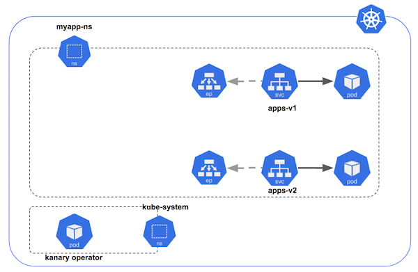
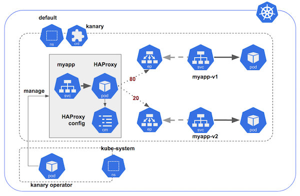

# Kanary : Canary Release Operator for Kubernetes
[](https://travis-ci.org/etiennecoutaud/kanary.svg?branch=master)
[](https://codecov.io/gh/etiennecoutaud/kanary)
[](https://goreportcard.com/report/github.com/etiennecoutaud/kanary)
[](https://github.com/etiennecoutaud/kanary/blob/master/LICENSE)


This Kubernetes operator aim to manage canary release deployment using HAProxy container as L4 (TCP) loadbalancer

## Operator installation
```
kubectl apply -f https://raw.githubusercontent.com/etiennecoutaud/kanary/master/manifests/kanary.yml
```

## How it works
Kanary Operator will acting on *kanary* CRD and will perform:
* HAProxy loabalancer generation
* Manage configuration and update based on **weight loadbalancing**
* Reference pod endpoint directly for more efficiency
* Trigger automatic HAProxy rolling update when configuration changed for no service outage
* Manage route as Kubernetes service to access to HAProxy

Kanary Operator is manipulating Kubernetes ressources:
* Deployment
* Endpoint
* ConfigMap
* Service

A RBAC dedicated role is needed to provide the ability to perform all operation on theses ressources

## CustomRessourceDefinitions

Kanary Operator manipulate *kanary* custom ressource, short name is *ky*

```
kubectl get kanary
NAME                 AGE
simple-kanary-rule   9s
```

```yaml
apiVersion: kanary.k8s.io/v1
kind: Kanary
metadata:
  name: simple-kanary-rule
spec:
  destination: myapp
  routes:
  - backend:
     serviceName: "myapp-v1"
     servicePort: "http"
    weight: 80
  - backend:
      serviceName: "myapp-v2"
      servicePort: 9090
    weight: 20
```
In this example:
* HAProxy will be exposed by *myapp* service, indicated in `destination` field
* Canary release is loadbalancing to *myapp-v1* and *myapp-v2* services previously created by the user
* HAProxy referenced to service backend port with `servicePort` fiels, it can be port name or port value
* Loadbalancing is performed based on `weight` field
* Multiple backends can be set, sum of weight must be equal to 100

## Architecture and example
Initial state: 2 version of the same application are running, each pods is exposed with a service


Kanary ressource is apply to the namespace to loadbalance pods depend on weight


This stack can be deployed in your cluster:
```
kubectl apply -f https://raw.githubusercontent.com/etiennecoutaud/kanary/master/examples/simple-stack.yml
```

## License
The work done has been licensed under Apache License 2.0. The license file can be found [here](LICENSE). You can find
out more about the license at [www.apache.org/licenses/LICENSE-2.0](//www.apache.org/licenses/LICENSE-2.0).

